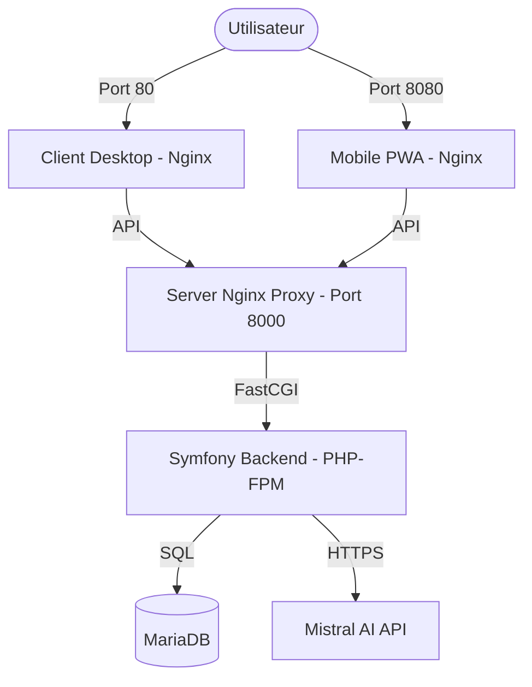

# Architecture du Projet Michelin Hackathon

Ce projet est une application multi-plateforme (Desktop et Mobile PWA) avec un backend Symfony, utilisant l'IA pour le fact-checking et la recommandation de restaurants.

## Global Overview

L'architecture repose sur des conteneurs Docker orchestrés par **Docker Swarm** sur un VPS Ubuntu.

### Composants principaux :

1.  **Frontend Desktop (Client)** :
    *   **Technologie** : Vue.js / Vite
    *   **Rôle** : Interface principale pour les utilisateurs desktop.
    *   **Serveur** : Nginx (Conteneur `michelin_client`)
    *   **Port** : 80

2.  **Frontend Mobile (Mobile PWA)** :
    *   **Technologie** : Vue.js / Vite (optimisé mobile)
    *   **Rôle** : Interface progressive web app pour mobile.
    *   **Serveur** : Nginx (Conteneur `michelin_mobile`)
    *   **Port** : 8080

3.  **Backend (Server)** :
    *   **Technologie** : PHP 8.2 / Symfony
    *   **Rôle** : API REST, gestion de la base de données, intégration Mistral AI.
    *   **Conteneur** : `michelin_server` (PHP-FPM) + `michelin_server-nginx` (Reverse Proxy API)
    *   **Port API** : 8000

4.  **Base de données (DB)** :
    *   **Technologie** : MariaDB 10.11
    *   *Volume* : `db_data` pour la persistance des données.

## Flux de données

1.  L'utilisateur accède au client via le port 80 ou 8080.
2.  Le frontend communique avec l'API Symfony sur le port 8000.
3.  Le serveur Symfony interroge la base MariaDB et utilise l'API Mistral pour les fonctionnalités d'IA.

## Infrastructure & Déploiement

*   **Orchestration** : Docker Swarm
*   **VPS** : Ubuntu 22.04 LTS (54.37.159.216)
*   **Stack name** : `michelin`
*   **Fichier de configuration** : `stack-swarm.yml`

### Schéma logique :

